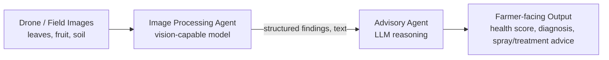

# Crop Health Advisor — AI Agents Capstone Project

> **Status:** Early planning stage. This repo is scaffolded from a Google Meet
> discussion (see `docs/original-idea-notes.md`) and will be fleshed out as the
> team builds it out for the *AI Agents: Intensive Vibe Coding Capstone Project*.

## The Idea

Build a **multi-agent system** that takes drone/field images of a crop
(starting with **sweet lime / mosambi, *Citrus limetta***) and tells a farmer:

- Is the crop healthy?
- Are there visible pests or diseases (e.g. root rot, leaf spot, canker)?
- What should be sprayed / treated, and where?
- An overall health score / evaluation for the field or orchard.

The system should also be able to look at soil images, not just leaves and
fruit, and eventually generalize to other crops (chilli, cotton, etc.).

-> so the plan is to start with **one crop** and pull together publicly
available images/datasets, prove the pipeline works end-to-end, then swap in
real drone footage later. See [`docs/DATASETS.md`](docs/DATASETS.md) for
what's actually out there for sweet lime / citrus.

## Proposed Architecture

Two agents, chained together:



1. **Image Processing Agent** (`agents/image_processing_agent/`)
   Takes raw images (leaf close-ups, whole-tree drone shots, soil) and turns
   them into structured text: plant healthiness, visible pest/disease
   symptoms, soil condition notes. This can be a dedicated vision/classification
   model, or a multimodal LLM doing the same job directly — open question,
   see `docs/original-idea-notes.md`.

2. **Advisory Agent** (`agents/advisory_agent/`)
   Takes the structured findings from step 1 (plus whatever crop-specific
   agronomic knowledge we build up) and produces the actual recommendation:
   overall evaluation, what's wrong, what to do about it (e.g. "this looks
   like root rot, here's what to do" / "no major issues, minor pest pressure,
   consider X").

Open question from the discussion: do we need a **separate image
classification model per crop** feeding into the LLM, or can a single
multimodal model (image + text) do both steps? Worth prototyping both ways
on the sweet lime dataset before committing.

## Repo Structure

```
sweet-lime-crop-advisor/
├── README.md                          # this file
├── docs/
│   ├── original-idea-notes.md         # cleaned-up notes from the meeting
│   └── DATASETS.md                    # dataset research for sweet lime / citrus
├── agents/
│   ├── image_processing_agent/        # vision analysis agent
│   └── advisory_agent/                # reasoning / recommendation agent
├── data/                               # local dataset staging (gitignored)
└── requirements.txt
```

## Next Steps

- [ ] Pick and download a starter dataset (see `docs/DATASETS.md`)
- [ ] Prototype the Image Processing Agent on a handful of sample images
- [ ] Decide: dedicated vision model vs. multimodal LLM for step 1
- [ ] Prototype the Advisory Agent on the outputs from step 1
- [ ] Wire the two agents together end-to-end on sweet lime
- [ ] Stretch: generalize to chilli, cotton

## Collaborating

Framework/architecture write-up above is the starting point — pick a piece
(image agent, advisory agent, dataset prep) and go. Open an issue or PR with
what you're picking up so we don't collide.
